class: left, bottom

# `r rmarkdown::metadata$title`
## `r rmarkdown::metadata$subtitle`

.center[
----
## `r rmarkdown::metadata$author`
]


```{r xaringan-themer, include=FALSE, warning=FALSE}
library(xaringanthemer)
devtools::install_github("hadley/emo")
library(emo)
style_mono_light(base_color = "#534e7b",
#style_duo(
 # primary_color = "#576675",
 # secondary_color="#f5f5dc", # FF7373
  header_font_google = google_font("KoHo"),
  text_font_google   = google_font("Roboto"),
  code_font_google   = google_font("Fira Mono")
)


```

<style type="text/css">

.remark-slide-content {
    font-size: 25px;
}

p{
text-align: justify;
}

.azul{
color:#23395b ;
}

code.bold{
}

.blanco{
color: white;
}

code.blanco{
color: white;
}

.small{ font-size: 70% }

.large{ font-size: 130% }


tr:nth-child(odd) {background-color: #f5f5f5;}

tr.high {
  background-color: #e64964;
  color: white;
}

td.high {
  background-color: #e64964;
  color: white;
}
th.high {
  background-color: #e64964;
  color: white;
}

td {
  text-align: center;
}

.chico .remark-code{ 
font-size: 13px;
}

.pull-left2 {
  float: left;
  width: 64%;
}
.pull-right2{
  float: right;
  width: 36%;
}

.chico2 .remark-code{ 
font-size: 16px;
}

.chico3 .remark-code{ 
font-size: 12px;
}


.chico4 .remark-code{ 
font-size: 7px;
}

.chico5 .remark-code{ 
font-size: 11px;
}

</style> 


---
class: inverse, middle

# Shiny `r emo::ji("sparkles")`

---
# Recordando como crear un archivo shiny:

.pull-left[ 

.center[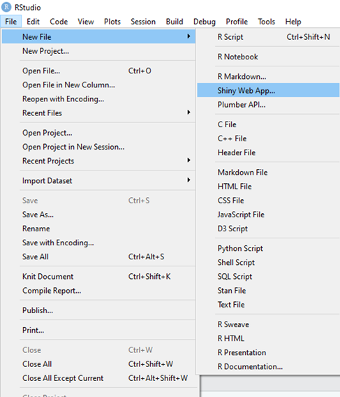]
]

.pull-right[

.center[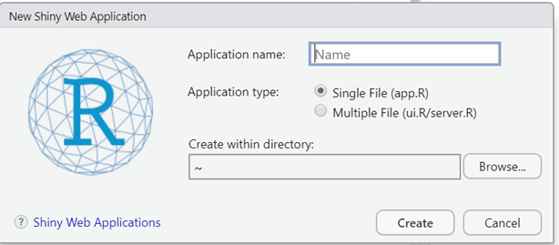]
]

---

## Librerías que usaremos hoy:

```{r, eval=FALSE}
library(shiny)          # App web
library(shinydashboard) # Para formato dashboard
library(shinyjs)        # Para usar entorno javascript
library(highcharter)    # Para graficos interactivos
library(DT)             # Para tablas
library(dplyr)          # Para manipulacion de bases de datos

### Base de datos a utilizar
library(readr)
Pokemon <- read_csv("Pokemon.csv")
````


---
class: inverse, center, middle
## RECOMENDACIÓN

### Evita utilizar caracteres con tildes, símbolos y letras "especiales" en tu shiny app, puesto que a veces arroja error de encoding :D

---
class: inverse, middle

# Shiny Dashboard 

---
## Creando un Dashboard desde cero:


.pull-left[
Estructura:
```{r, eval=FALSE}

## Barra superior del dashboard:
header <- dashboardHeader( )

## Menu de navegacion del dashboard:
sidebar <- dashboardSidebar( )

## Cuerpo de cada vineta del menu
body <- dashboardBody( )

ui <- dashboardPage(header, sidebar, body)
server <- function(input, output) {}

shinyApp(ui = ui, server = server)

````
]

.pull-right[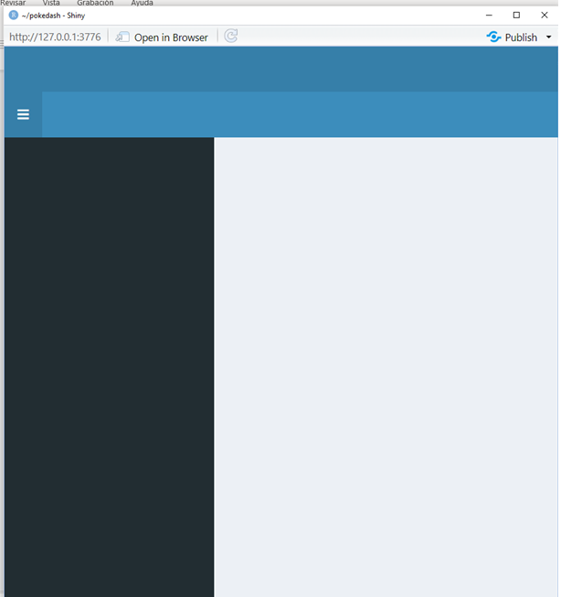]

---

.large[**Paquete  `dashboardtheme`**]


.pull-left[Podemos cambiar el tema predeterminado editando el "Body" de nuestro dashboard

```{r, eval=FALSE}

## Barra superior del dashboard:
header <- dashboardHeader( )

## Menu de navegacion del dashboard:
sidebar <- dashboardSidebar( )

## Cuerpo de cada vineta del menu
body <- dashboardBody(   
    shinyDashboardThemes(  #<<
    theme = "flat_red")    #<<
    )

ui <- dashboardPage(header, sidebar, body)
server <- function(input, output) {}

shinyApp(ui = ui, server = server)

```


]

.pull-right[
]


---
.large[**Paquete  `dashboardtheme`**]

Para revisar más temas ingresar [aquí](https://github.com/nik01010/dashboardthemes)

.pull-left[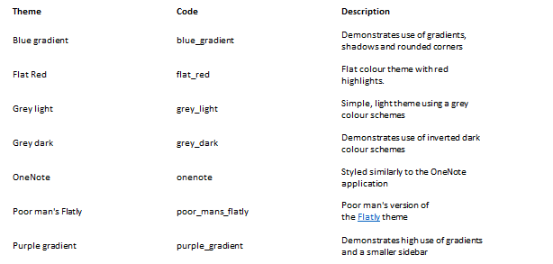

```{r, eval=FALSE}


# Cuerpo de cada vinieta del menu
body <- dashboardBody(   
    shinyDashboardThemes(
    theme = "onenote") #<<
    )
```

]

.pull-right[.center[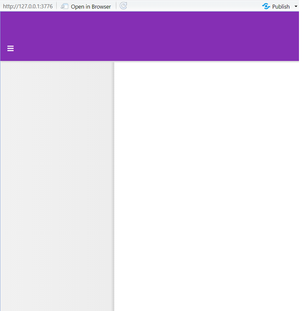
]]


---
.large[**Customizando el header**]

Añadiendo título al dashboard

```{r, eval=FALSE}


# Barra superior del dashboard:
header <- dashboardHeader( # Titulo del dashboard y Tamanio del titulo
    title="Pokemon Analytics", #<<  
    titleWidth=300             #<< 
)

```

.center[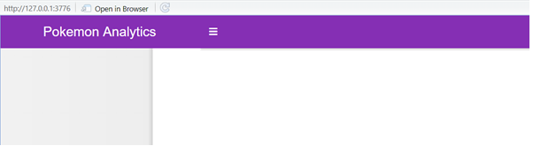]

---
.large[**Customizando el header**]

Añadiendo notificaciones y warnings

.pull-left2[.chico3[
```{r, eval=FALSE}

#Barra superior del dashboard:
header <- dashboardHeader(
    title="Pokemon Analytics",                              #Titulo del dashboard
    titleWidth=300,                                         #Tamano del dashboard
    
    #Anadiendo notificaciones en el dashboard
    dropdownMenu( #<<
      type="message",                            # Menu emergente del tipo 'mensaje'
        messageItem(
        from = "Las ayudantes dicen:", #'emisor del mensaje'
        message = HTML("Dudas? No dudes en consultar :)"), # Mensaje
        icon = icon("question"), #icono del mensaje
        time = substr(Sys.time(), start=12, stop=16)        # Hora que queremos que aparezca
    )),
    dropdownMenu( #<<
      type = "notifications", #Menu emergente del tipo 'notificacion'
                 notificationItem(
                     text = "Ultima ayudantia!!",
                     icon("users")
    )),
    
    dropdownMenu(  #<<
      type = "tasks", badgeStatus = "success", #Menu emergente del tipo task
                 taskItem(value = 90, color = "green",
                          "Status Diplomado"
    ))
    )

```
]]

.pull-right2[.center[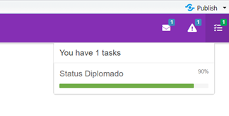]
]

---
.large[**Customizando el sidebar**]

Añadiendo una pestaña:

```{r, eval=FALSE}

# Menu de navegacion del dashboard:
sidebar <- dashboardSidebar(  #<<
    width = 250,                                # Tamano del sidebar
    sidebarMenu(
        id='sidebar',                           # Nombre identificador del sidebar
        menuItem('Tabla con datos de pokemones',# Nombre de la pestana 1 en el dash
                 tabName = 'menu1')
    ))

```

.center[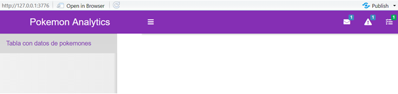]


---
.large[**Customizando el sidebar**]

Añadiendo otra pestaña:

```{r, eval=FALSE}

# Menu de navegacion del dashboard:
sidebar <- dashboardSidebar(
    width = 250,                                # Tamano del sidebar
    sidebarMenu(  #<<
        id='sidebar',                           # Nombre identificador del sidebar
        menuItem('Tabla con datos de pokemones',# Nombre de la pestana 1 en el dash
                 tabName = 'menu1'),
        menuItem('Graficos por tipo de pokemon',# Nombre de la pestana 2 en el dash
              tabName = 'menu2'))
 )

```

.center[]

---

.large[**Customizando el sidebar**]

Añadiendo una pestaña jerárquica:

```{r, eval=FALSE}

#Menu de navegacion del dashboard:
sidebar <- dashboardSidebar(
    width = 250,                                 # Tamano del sidebar
    sidebarMenu(
        id='sidebar',                            # Nombre identificador del sidebar
        menuItem('Tabla con datos de pokemones', # Nombre de la pestana 1 en el dash
                 tabName = 'menu1'),  #<<
        menuItem('Graficos por tipo de pokemon', # Nombre de la pestana 2 en el dash
              tabName = 'menu2', startExpanded = T,
              menuItem('Grafico de dispersion', tabName="menu21", 
                       icon = icon("zoom-in",lib = "glyphicon")))
        )
)

```
.center[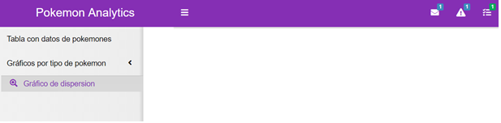]

---

.large[**Customizando el sidebar**]

Añadiendo un input en el sidebar al nivel de la segunda pestaña:

.pull-right2[.center[]]

.chico[
```{r, eval=FALSE}

#Menu de navegacion del dashboard:
sidebar <- dashboardSidebar(
    width = 250, #Tamanio del sidebar
    sidebarMenu(
        id='sidebar',                            # Nombre identificador del sidebar
        menuItem('Tabla con datos de pokemones', # Nombre de la pestana 1 en el dash
                 tabName = 'menu1'),
        menuItem('Graficos por tipo de pokemon', # Nombre de la pestana 2 en el dash
              tabName = 'menu2', startExpanded = T,
              div(id = "sidebar1",  #<<
                  conditionalPanel("input.sidebar === 'menu21'",
                                   selectizeInput("select_tipo1",
                                                  "Seleccione Tipo",
                                                  choices = unique(Pokemon$`Type 1`),
                                                  selected = "", width = "300px",
                                                  multiple = F))),
              menuItem('Grafico de dispersion', tabName="menu21", 
                       icon = icon("zoom-in",lib = "glyphicon")))
        )
)


````
]
---
.large[**Estructura del body**]

Estructurando la pestaña "menu21":

```{r, eval=FALSE}
# Cuerpo de cada vineta del menu
body <- dashboardBody(
    shinyDashboardThemes(
        theme = "onenote"),
    tabItems(  #<<
        tabItem(tabName = "menu21",
                h1("Gráficas de dispersión por tipo"),
                fluidRow(highchartOutput("graf1"))
    )))


````

.center[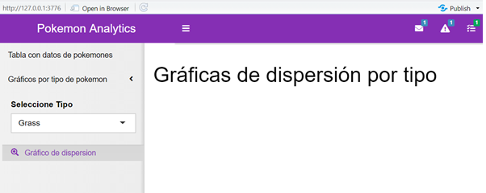]

---
.large[**Estructura del body** (Estructurando la pestaña "menu21")]

Definiendo el gráfico dependiendo del input "select_tipo1" en el server.
.chico2[
```{r, eval=FALSE}
server <- function(input, output) {
         output$graf1 <- renderHighchart({  #<<
        hchart(Pokemon %>%
                   filter(`Type 1`==input$select_tipo1), # Filtra por el tipo de pokemon seleccionado
               "scatter", hcaes(x = Speed, y = Attack)) %>%  # Grafico de dispersion y variables x e y
            hc_yAxis(title = list(text = "Attack"))%>% # Titulo eje y
            hc_title(text=paste("Velocidad y Ataque de Pokemones de tipo",
                                input$select_tipo1), # Titulo del grafico
                     align = "center")%>% 
            hc_tooltip(pointFormat= "Attack: {point.y} <br>
Speed:{point.x}" ) %>% #tooltip desplegable al posicionar el raton encima de cada punto
            hc_add_theme(hc_theme_google()) #tema a usar
    })
}


````
]

.center[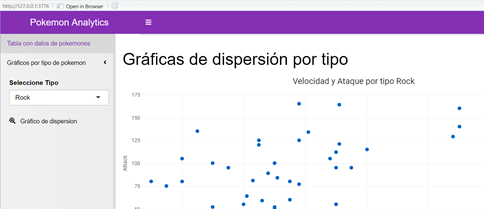]

---

.large[**Estructura del body**]

Estructurando la pestaña "menu1":

```{r, eval=FALSE}
#Cuerpo de cada vineta del menu
body <- dashboardBody(
    shinyDashboardThemes(
        theme = "onenote"),
    tabItems(
        tabItem(tabName = "menu1",  #<<
                h1("Tabla de datos"),
                fluidRow(dataTableOutput("table1"))
        ),
        tabItem(tabName = "menu21",
                h1("Gráficas de dispersión por tipo"),
                fluidRow(highchartOutput("graf1")))
    )
)

````

---

.large[**Estructura del body** (Estructurando la pestaña "menu1")]

Definiendo la tabla "table 1" en el server:


.pull-left2[.chico5[
```{r, eval=FALSE}
server <- function(input, output) {
    output$table1 <- renderDataTable({  #<<
        datatable(na.omit(Pokemon[,-1]), # Datos a mostrar
                  filter = list(position = "top"), # Posicion del buscador
                  options = list(dom="t", # Elimina un search grande de arriba
                                 #autoWidth = TRUE , # Esto hace que se ajuste el ancho
                                 pageLength = 8,  # Se muestran 8 registros por pagina
                                 scrollX = TRUE)) # Se avanza con una barra deslizante horizontal
                                 })
    
    output$graf1 <- renderHighchart({
        hchart(Pokemon %>%
                   filter(`Type 1`==input$select_tipo1), # Filtra por tipo de pokemon seleccionado
               "scatter",                        # Grafico de dispersion
               hcaes(x = Speed, y = Attack)) %>% # variables x e y
            hc_yAxis(title = list(text = "Attack"))%>% #titulo eje y
            hc_title(text=paste("Velocidad y Ataque de Pokemones de tipo",
                                input$select_tipo1), # Titulo del grafico
                     align = "center")%>% 
            hc_tooltip(pointFormat= "Attack: {point.y} <br>
Speed:{point.x}" ) %>% # tooltip desplegable al posicionar el raton encima de cada punto
            hc_add_theme(hc_theme_google()) #tema a usar
    })
}
````
]]

.pull-right2[.center[]]


---

.large[**Extra: Añadiendo logo al header**]

Puede ser de interés añadir un logo a nuestra shiny app. Para ello debemos editar el título con los siguientes comandos:


.chico2[
```{r, eval=FALSE}

# Barra superior del dashboard:
header <- dashboardHeader(  #<<
    title= a(href='https://www.pokemon.com/el/', 
            img(src='https://upload.wikimedia.org/wikipedia/commons/9/98/International_Pok%C3%A9mon_logo.svg', 
                width='200px',height='50px')),
    ...  # Resto del codigo
    
````
]

.pull-right2[ .center[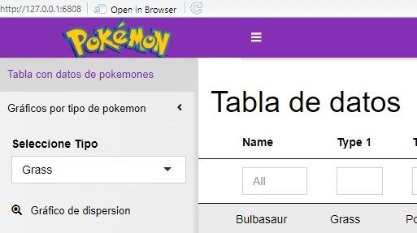]
]

.pull-left2[ La personalización usada corresponde a ajustes CSS
  - a(): Crea un enlace a una pág web. 
  - img(): Añade una imagen.
]

---

.large[**Código final**]


.pull-left[.chico4[
```{r, eval=FALSE}
library(shiny) #App web
library(shinydashboard) #Para formato dashboard
library(shinyjs) #Para usar entorno javascript
library(highcharter) #Para graficos interactivos
library(DT) #Para tablas
library(dplyr) #Para manipulacion de bases de datos
library(dashboardthemes) #Para modificar el theme de un shinydashboard
###Base de datos a utilizar
library(readr)
Pokemon <- read_csv("Pokemon.csv")
#Barra superior del dashboard:
header <- dashboardHeader(
    title= a(href='https://www.pokemon.com/el/',
             img(src='https://upload.wikimedia.org/wikipedia/commons/9/98/International_Pok%C3%A9mon_logo.svg',
                 width='200px',height='50px')), # Titulo del dashboard con logo
    titleWidth=300,                                         #Tamano del dashboard
    
    #Anadiendo notificaciones en el dashboard
    dropdownMenu( 
      type="message",                            # Menu emergente del tipo 'mensaje'
        messageItem(
        from = "Las ayudantes dicen:", #'emisor del mensaje'
        message = HTML("Dudas? No dudes en consultar :)"), # Mensaje
        icon = icon("question"), #icono del mensaje
        time = substr(Sys.time(), start=12, stop=16)        # Hora que queremos que aparezca
    )),
    dropdownMenu( 
      type = "notifications", #Menu emergente del tipo 'notificacion'
                 notificationItem(
                     text = "Ultima ayudantia!!",
                     icon("users")
    )),
    
    dropdownMenu(  
      type = "tasks", badgeStatus = "success", #Menu emergente del tipo task
                 taskItem(value = 90, color = "green",
                          "Status Diplomado"
    ))
)
#Menu de navegacion del dashboard:
sidebar <- dashboardSidebar(
    width = 250, #Tamanio del sidebar
    sidebarMenu(
        id='sidebar', # Nombre identificador del sidebar
        menuItem('Tabla con datos de pokemones', # Nombre de la pestana 1 en el dash
                 tabName = 'menu1'),
        menuItem('Graficos por tipo de pokemon', # Nombre de la pestana 2 en el dash
                 tabName = 'menu2', startExpanded = T,
                 div(id = "sidebar1",
                     conditionalPanel("input.sidebar === 'menu21'",
                                      selectizeInput("select_tipo1",
                                                     "Seleccione Tipo",
                                                     choices = unique(Pokemon$`Type 1`),
                                                     selected = "", width = "300px",
                                                     multiple = F))),
                 menuItem('Grafico de dispersion', tabName="menu21",
                          icon = icon("zoom-in",lib = "glyphicon")))
    )
)

````
]]


.pull-right[.chico4[
```{r, eval=FALSE}

#Cuerpo de cada vinieta del menu
body <- dashboardBody(
    shinyDashboardThemes(
        theme = "onenote"),
    tabItems(
        tabItem(tabName = "menu1",
                h1("Tabla de datos"),
                fluidRow(dataTableOutput("table1"))
        ),
        tabItem(tabName = "menu21",
                h1("Graficas de dispersion por tipo"),
                fluidRow(highchartOutput("graf1")))
    )
)
ui <- dashboardPage(header, sidebar, body)
server <- function(input, output) {
    output$table1 <- renderDataTable({
        datatable(na.omit(Pokemon[,-1]), # Datos a mostrar
                  filter = list(position = "top"), # Posicion del buscador
                  options = list(dom="t", # Elimina un search grande de arriba
                                 #autoWidth = TRUE , #esto hace que se ajuste el ancho
                                 pageLength = 8, #Se muestran 8 registros por pagina
                                 scrollX = TRUE)) # Se avanza con una barra deslizante horizontal
                                 })
    
    output$graf1 <- renderHighchart({
        hchart(Pokemon %>%
                   filter(`Type 1`==input$select_tipo1), # Filtra por el tipo de pokemon seleccionado
               "scatter", hcaes(x = Speed, y = Attack)) %>%  # Grafico de dispersion y variables x e y
            hc_yAxis(title = list(text = "Attack"))%>% #titulo eje y
            hc_title(text=paste("Velocidad y Ataque de Pokemones de tipo", 
                                input$select_tipo1), # Titulo del grafico
                     align = "center")%>% 
            hc_tooltip(pointFormat= "Attack: {point.y} <br>
Speed:{point.x}" ) %>% # tooltip desplegable al posicionar el raton encima de cada punto
            hc_add_theme(hc_theme_google()) #tema a usar
    })
}
shinyApp(ui = ui, server = server)

````
]]


---

## Material complementario:

- https://shiny.rstudio.com/images/shiny-cheatsheet.pdf


- https://shiny.rstudio.com/gallery/


- https://jkunst.com/highcharter/articles/shiny.html


---
class: inverse, center, middle

# ¡Gracias! 

