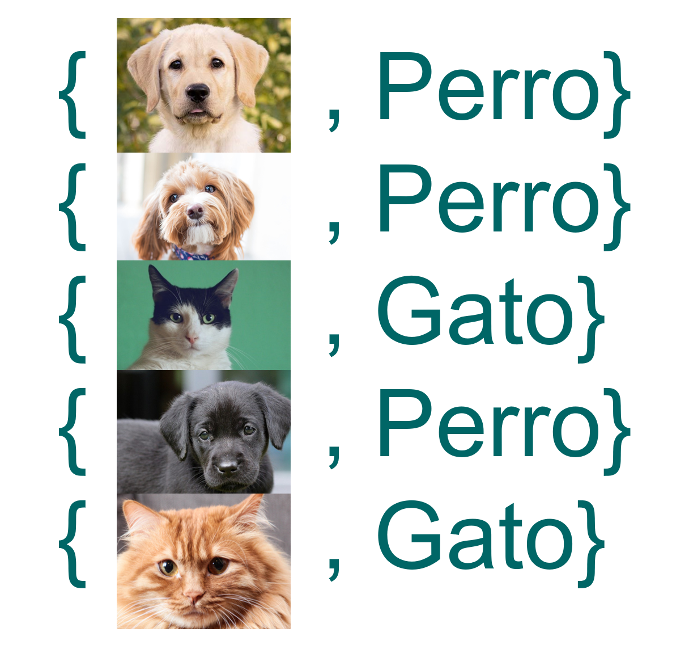
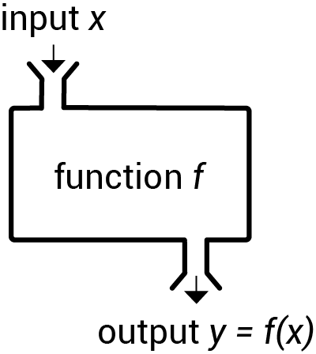
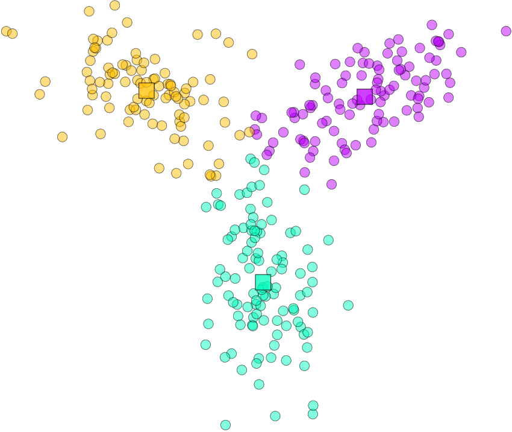
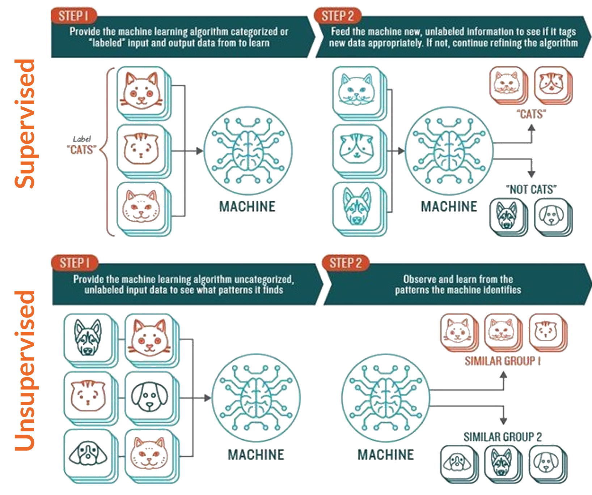
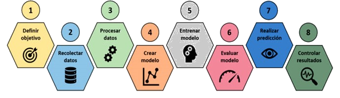
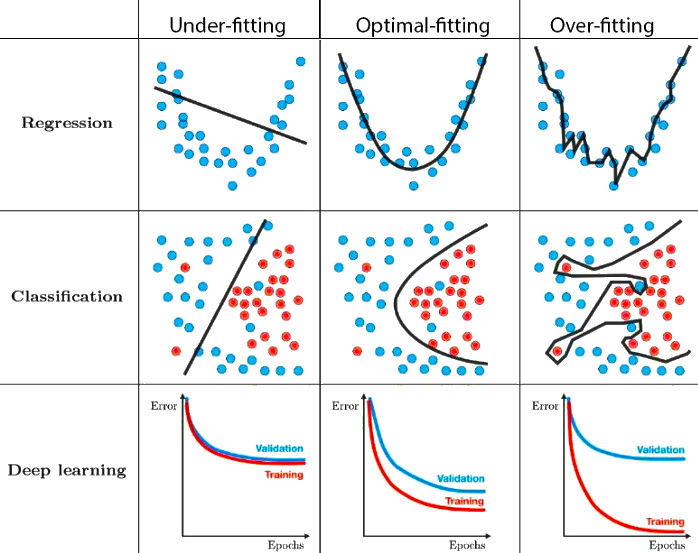
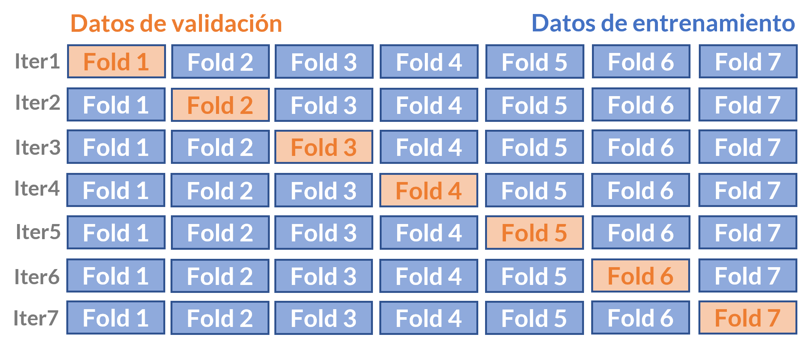

class: middle, bottom
background-image: url(media/logo.png)
background-position: 50% 10%
background-size: 60%

<style type="text/css">

.remark-slide-content {
    font-size: 23px;
}

.remark-code{ 
font-size: 23px;
}

p{
text-align: justify;
}

.azul{
color:#23395b ;
}

.grone{
color: black;
}

code.bold{
font-weight: bold;
}

.blanco{
color: white;
}

.aux{
color: #f1e2ff
}


code.blanco{
color: white;
font-weight: bold;
}

.small{ font-size: 23px }

.large{ font-size: 110% }

.larger{ font-size: 150% }

tr:nth-child(odd) {background-color: #f5f5f5;}

tr.high {
  background-color: #e64964;
  color: white;
}

td.high {
  background-color: #e64964;
  color: white;
}
th.high {
  background-color: #e64964;
  color: white;
}

td {
  text-align: center;
}


</style> 

.center[
<h2 style="color:#000000"> Clase 2: Tipos de Aprendizaje y Etapas del modelamiento en Machine Learning </h2>


<div style="color:#43434c; font-size: 40px;"><b>Herramientas Computacionales para Data Science</b></div>

<div style="color:#43434c; font-size: 45px;">Jonathan Acosta - Danilo Alvares - Luis Castro </div>
]
</br>

```{r xaringan-themer, include=FALSE, warning=FALSE}
library(xaringanthemer)
#style_mono_accent(base_color = "#828078",
style_duo(
  primary_color = "#95D1DF",#"#F1E2FF", #"#e2e2ff",
  secondary_color="#43434c", # FF7373
  header_font_google = google_font("Poppins"),
  text_font_google   = google_font("Roboto"),
  code_font_google   = google_font("Fira Mono")
)

options(htmltools.preserve.raw = FALSE)
```

---
<br>
<br>
<br>

### Recordemos... ¿Qué es el Machine Learning?

El Machine Learning es la capacidad de las computadoras de aprender sin ser explícitamente programadas para un determinado propósito o tarea. Esta capacidad de aprendizaje se basa en los algoritmos (conjunto de instrucciones o reglas definidas, no ambiguas, ordenadas y finitas). 

En Machine Learning, un algoritmo se aplica a los datos, lo que da origen a lo que llamamos _modelo_.  Lo que buscan los modelos es generalizar lo suficientemente bien como para predecir o clasificar casos nuevos de forma precisa. 


---

class: middle, inverse

# Tipos de Aprendizaje 

---

### Clasificación de imágenes 

Imagine que tenemos un conjunto de imágenes de gatos y perros y cada imagen tiene su etiqueta respectiva. La idea es que al entrenar el modelo (que se obtiene de la aplicación de un algoritmo en los datos de entrenamiento), si ingresa una nueva imagen, se pueda predecir con alta precisión si la imagen corresponde a un gato o a un perro.

<center>

</center>

---
<br>
<br>
<br>
 
### Los algoritmos aprenden de los datos

Sabemos que los algoritmos se aplican a los datos y un detalle muy importante es que dependiendo del _approach_ del problema, tendremos ciertas diferencias en los datos y su estructura que harán que el algoritmo tenga que aprender de una forma determinada. 

Profundizaremos en:

- Algoritmos de Aprendizaje Supervisado
- Algoritmos de Aprendizaje No Supervisado

---

### Clasificación de imágenes

En el ejemplo anterior, teníamos un conjunto de imágenes y cada imagen tenía su etiqueta: si era gato o perro. El conjunto de datos se encuentra estructurado de la siguiente forma:

<center>

</center>

---

### Gatos y Perros etiquetados: Aplicación de Algoritmos Supervisados

En los algoritmos de Aprendizaje Supervisado la data es de la forma $\left \{x_i, y_i\right \}_{i=1}^{n}$ donde $X=\left \{x_i\right \}_{i=1}^{n}$ se denominan _inputs_ o _variables de entrada_ e $y_i$ es el _output_ o _variable de salida_. El modelo representa la _función de mapeo_ $f(X)$ de los inputs a los outputs:

<center>

</center>

Dependiendo de la naturaleza de la variable respuesta $Y$, el modelo es de clasificación (si $Y$ es categórica) o de regresión (si $Y$ es numérica). Es importante reconocer la naturaleza de la variable respuesta pues a partir de esta, descartamos los modelos que no serían adecuados para el caso de estudio.

---

### ¿Qué hubiera pasado si hubiéramos tenido las imágenes de perros y gatos <u>no etiquetadas</u>?


<br>
<br>
El enfoque hubiera sido distinto, ya que no existiría la componente $Y$ (output) explícita. En dicho caso, hablamos de un caso de Aprendizaje No Supervisado, y lo que se busca es determinar _grupos_ o _semejanzas_ en las imágenes, de modo que utilizando los features adecuados, en un grupo queden la mayoría de las imágenes de gatos y en otro grupo las imágenes de perros (grupos homogéneos en sí mismos y heterogéneos entre ellos). 

Ejemplo de Algoritmo No Supervisado: _Clustering._

---

### Mismo problema, distinto enfoque

<center>

</center>

---

class: middle, inverse

# Conceptos de Modelamiento en Machine Learning


---

### Etapas de una solución analítica en Machine Learning

Llegar a una solución analítica es un proceso que parte desde comprender el problema, estructurar y recopilar la data hasta controlar, monitorear y utilizar los resultados de la solución. 

<center>

</center>


Ya aprendimos que dependiendo del tipo de enfoque (Supervisado o No Supervisado) los algoritmos aprenden de forma diferente y por lo tanto, son diferentes. También sabemos que dependiendo del tipo de variable respuesta (categórica o numérica) debemos descartar ciertos modelos (por ejemplo, si $Y$ es categórica, no tiene sentido utilizar una regresión lineal). Otra parte fundamental de un modelo es la etapa de entrenamiento y posteriormente, la etapa de prueba, ¿qué datos utilizar? ¿de qué manera evaluar al modelo? 

---

### Datos de Entrenamiento y Prueba, ¿qué son?

#### Datos de Entrenamiento

Corresponde al conjunto de datos utilizado para ajustar el modelo, también puede ser utilizado para proporcionar una evaluación imparcial de un ajuste del modelo en el conjunto de datos de entrenamiento mientras se ajustan los hiperparámetros del modelo. 

#### Datos de Prueba

Corresponde al conjunto de datos utilizado para proporcionar una evaluación del ajuste final del modelo entrenado por los datos de entrenamiento.

Notar que estos conjuntos de datos (Entrenamiento y Prueba) son disjuntos. La idea de los Datos de Prueba es exponer al modelo a situaciones (datos) nuevas y evaluar su rendimiento.

Usualmente el conjunto de datos de Entrenamiento es más grande que el de Prueba y se obtienen de forma aleatoria.


---

### Split simple

Un Split simple consiste en una partición aleatoria definiendo las proporciones del conjunto de Entrenamiento y Prueba.

#### En R: Split 70% - 30%

```{r message=FALSE, eval=FALSE}
ind_train <- sample(1:nrow(data), size = 0.7*nrow(data), replace = FALSE)

library(dplyr)

iris_train <- data %>% slice(ind_train)
iris_test <- data %>%  slice(-ind_train)
```

#### En Python: Split 70% - 30%

```{r, eval=FALSE}
from sklearn.model_selection import train_test_split

X_train, X_test, y_train, y_test = train_test_split(X, y, test_size=0.3)

```

---

#### Falencias del Modelo derivadas por baja calidad o cantidad de los datos de Entrenamiento

##### Underfitting (subajuste - Alto sesgo y baja varianza)

Si nuestros datos de entrenamiento son muy pocos, nuestro modelo no será capaz de generalizar el conocimiento y estará incurriendo en un ajuste deficiente.

##### Overfitting (sobreajuste - Alta varianza y bajo sesgo)

Al entrenar demasiado o entrenar con datos “raros”, el modelo se ajusta a características muy específicas de los datos de entrenamiento, lo que puede provocar que los datos nuevos queden muy mal clasificados ya que el modelo se aprendió demasiado bien los datos de entrenamiento.

##### Sesgo estereotipado

Un modelo es tan bueno como sus datos lo sean. Han existido diversos casos donde modelos de Machine Learning entregan resultados sexistas o racistas. Por ejemplo, entrenar un modelo basado en imágenes de publicidad de productos de cocina y finalmente llegar a asociar al sexo femenino con estos productos, pues, en las imágenes del conjunto de datos de entrenamiento aparecían solo mujeres usando artículos de cocina. 
<a href="https://arxiv.org/pdf/1707.09457.pdf">Leer caso aquí.</a>

---
### Underfitting & Overfitting

<center>

</center>

---

#### Técnicas para tratar falencias del Modelo

##### Underfitting

- Incrementar la complejidad del modelo
- Aumentar el número de covariables
- Eliminar el ruido de los datos
- Aumentar la etapa de Entrenamiento

##### Overfitting

- Reducir la complejidad del modelo
- Utilizar métodos de regularización (Ridge o Lasso)
- Disminuir la etapa de Entrenamiento
- Usar dropout de redes neuronales 


##### Sesgo estereotipado

- Recolectar mejores datos: Más variados y de calidad

---
<br>
<br>
<br>

### Cross Validation

La validación cruzada (CV) es una técnica muy útil para evaluar la efectividad del modelo, particularmente en los casos en que se necesita mitigar el sobreajuste.

Consiste en una técnica para obtener una estimación más confiable del rendimiento del modelo utilizando solo sus datos de entrenamiento. 

También es útil para determinar los hiperparámetros del modelo, en el sentido de obtener un error de prueba más bajo.

---

### K - Fold Cross Validation

Consiste en dividir los datos en $k$ subconjuntos de igual tamaño y repetir el procedimiento $k$ veces de modo que cada vez, uno de los $k$ subconjuntos sea el conjunto de prueba y los otros $k-1$ subconjuntos forman el conjunto de entrenamiento.



Pasos:
- Entrenar modelo con el grupo $(1,2,…,i-1,i+1,…,k)$
- Testear con el grupo $i$
- Guardar métricas de testeo en el grupo $i$
- Repetir para todos los posibles $i=(1,2,…,k)$ 

---

class: middle, inverse

### Ejemplo

Con la librería caret podemos realizar K - Fold Cross Validation, en este ejemplo, en un modelo de regresión lineal:

```{r, message=FALSE}
library(caret)

train.control_cv <- trainControl(method = "cv", number = 5) #N° de folds

#Se especifica el modelo
model_cv <- train(speed ~., data = cars, method = "lm", 
               trControl = train.control_cv) 

model_cv$results #Resultados resumidos 
```

---

class: middle, inverse

```{r}
model_cv$resample #Resultados de cada iteración
```

---

### Métricas de cada iteración en Cross Validation

- RMSE: Raíz del error cuadrático medio. Se calcula, para cada iteración:

$$RMSE_{i}= \sqrt{\frac{\sum_{l=1}^{n_{i}}{(y_{l}- \hat{y}_{l})^{2}}}{n_{i}}}$$

Donde $y_{l}$ es la observación, $\hat{y}_{l}$ es el valor ajustado por el modelo y $n_{i}$ corresponde al tamaño del $j$ ésimo pliegue.

- MAE: Error absoluto medio. Se calcula, para cada iteración:

$$MAE_{i}= \frac{\sum_{l=1}^{n_{i}}{|y_{l}- \hat{y}_{l}|}}{n_{i}}$$
Estas métricas sirven para comparar modelos.
---

#### K - fold Cross Validation
También se puede aplicar el método Repeated K - fold Cross Validation, donde el proceso de hacer split en k pliegues puede iterarse un determinado número de veces:

```{r}
train.control_rcv <- trainControl(method = "repeatedcv", 
                              number = 5, repeats = 3)

model_rcv <- train(speed ~., data = cars, method = "lm", 
               trControl = train.control_rcv) 

model_rcv$results 
```

---

### Otras variaciones de Cross Validation


#### Leave one out Cross Validation (LOOCV)

En cada iteración se utiliza una sola observación para el conjunto de datos de prueba, dejando al resto como set de entrenamiento, es decir, el modelo se ajusta utilizando $n – 1$ observaciones de entrenamiento.

```{r}

train.control_lpocv <- trainControl(method = "LOOCV")

model_lpocv <- train(speed ~., data = cars, method = "lm", 
               trControl = train.control_lpocv) 

model_lpocv$results 

```


---

#### Leave Group Out Cross Validation (LGOCV)

En este caso, se entrena con un porcentaje de los datos y se prueba con el porcentaje restante, en cada iteración.

```{r}

train.control_lgocv <- trainControl(method = "LGOCV", number = 10, p=.9)

model_lgocv <- train(speed ~., data = cars, method = "lm", 
               trControl = train.control_lgocv) 

model_lgocv$results 

```


---
class: middle, inverse

# ¡Gracias!

